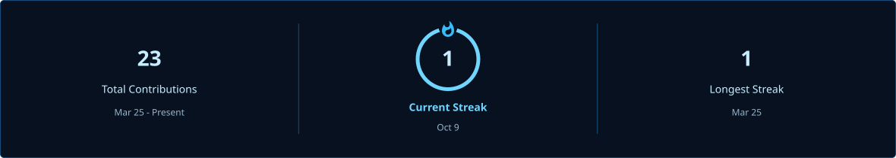
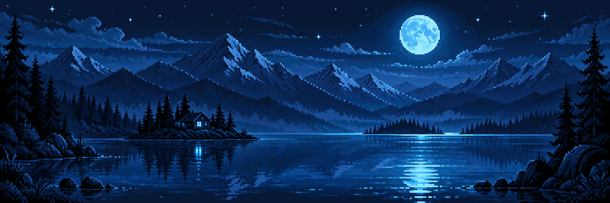

  

  <strong>Hi, I'm Erzhan — an IT specialist working with Python 3, Java and C++.</strong> 
  A SMALL WORLD OF PIXELS &nbsp; · &nbsp; BLUE HOUR &nbsp; · &nbsp; IDEAS

<h3 align="center">Activity, in azure</h3>

   
  
   
  Language proportions reflect code in my public repositories.

  

<h3 align="center">A world in pixels</h3>

  

  <a href="https://github.com/Erzhan-mul/pixel-world"><strong>Explore Pixel World →</strong></a> 
  A tiny website with a living pixel room, a moving name, and a blue-hour mood.

  
  &nbsp;
  
  &nbsp;
  

