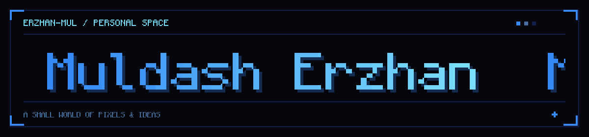

  

  <strong>Hi, I'm Erzhan. Welcome to my little corner of GitHub.</strong> 
  PIXELS &nbsp; · &nbsp; BLUE HOUR &nbsp; · &nbsp; IMAGINATION

<h3 align="center">A world in pixels</h3>

  

  <a href="https://github.com/Erzhan-mul/pixel-world"><strong>Explore Pixel World →</strong></a> 
  A tiny website with a living pixel room, a moving name, and a blue-hour mood.

  <a href="https://www.linkedin.com/in/erzhan-muldash-075642430/">LinkedIn</a>
  &nbsp; · &nbsp;
  <a href="https://github.com/Erzhan-mul">GitHub</a>

